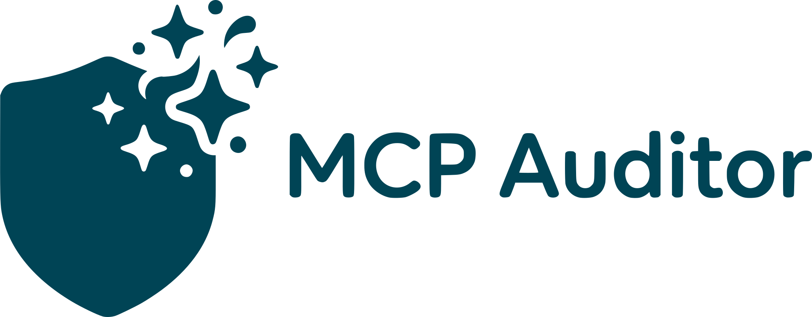

<div align="center">



### *The LLM Multi Tool for Code Auditing*

[](https://modelcontextprotocol.io)
[](https://opensource.org/licenses/MIT)
[](https://www.typescriptlang.org/)
[](https://nodejs.org/)

**A powerful Model Context Protocol (MCP) server that provides structured code insights for estimation, security auditing, and professional report writing.**

</div>


## ✨ Features at a Glance

<table>
<tr>
<td width="33%" align="center">

### 📊 **Estimation**
Calculate code complexity metrics and estimate audit effort with precision

</td>
<td width="33%" align="center">

### 🛡️ **Auditing**
Map systems, identify security hotspots, and confirm vulnerabilities

</td>
<td width="33%" align="center">

### 📝 **Writing**
Generate professional audit reports in OpenZeppelin style

</td>
</tr>
</table>

## 🌐 Supported Languages

<div align="center">

| Language | Entrypoints | Peek | Call Graphs | Metrics | Status |
|:--------:|:-----------:|:-----------:|:-----------:|:-------:|:------:|
| 🔷 **Solidity** | ✅ | ✅ | ✅ | ✅ | **Full Support** |
| ⚡ **C++** | ❌ | ✅ | ⏳ | ✅ | Partial |
| ☕ **Java** | ❌ | ✅ | ⏳ | ✅ | Partial |
| 🐹 **Go** | ❌ | ✅ | ⏳ | ✅ | Partial |
| 🦀 **Rust** | ❌ | ✅ | ⏳ | ✅ | Partial |

</div>

## 📦 Installation

### Via Gemini CLI Extension

```bash
# Install the MCP server
gemini extensions install <this repository URL>

# Verify installation
gemini extensions list
```

### Local Development Setup

```bash
# Clone the repository
git clone <repository-url>
cd mcp-auditor

# Install dependencies
pnpm install

# Build the project
pnpm build

# Run tests
pnpm test

# Watch mode for development
pnpm test:watch
```

---

## 🧰 Available Tools

> [!TIP]
> All tools support **glob patterns** for the `paths` parameter, making it easy to analyze multiple files at once!

<table>
<thead>
<tr>
<th width="15%">Tool</th>
<th width="20%">Inputs</th>
<th width="20%">Output</th>
<th width="45%">Purpose</th>
</tr>
</thead>
<tbody>
<tr>
<td><code>entrypoints</code></td>
<td><code>paths</code> (string[])</td>
<td><code>Entrypoint[]</code></td>
<td>🎯 List all public/external functions to map the attack surface</td>
</tr>
<tr>
<td><code>peek</code></td>
<td><code>paths</code> (string[])</td>
<td><code>Signature[]</code></td>
<td>👀 Extract function signatures for a quick codebase overview</td>
</tr>
<tr>
<td><code>metrics</code></td>
<td><code>paths</code> (string[])</td>
<td><code>Metrics[]</code></td>
<td>📏 Calculate NLoC, complexity, and effort estimates</td>
</tr>
<tr>
<td><code>callgraph</code></td>
<td><code>paths</code> (string[])</td>
<td><code>CallGraph</code></td>
<td>🕸️ Generate call graphs (nodes/edges) for flow analysis</td>
</tr>
</tbody>
</table>

---

## 🔄 Command Workflows

The `commands/` directory contains **TOML-based systematic prompts** for structured analysis:

### 1️⃣ Estimation Workflow

```
/estimate:discovery  → Identify scope and chunk files
/estimate:explore    → Categorize files and refine scope
/estimate:metrics    → Calculate complexity and effort
/estimate:report     → Generate final estimation report
```

**Perfect for:** Project scoping, effort estimation, resource planning

### 2️⃣ Audit Workflow

```
/audit:map     → Build system map (contracts, invariants, flows)
/audit:hunt    → Identify security hotspots (high recall)
/audit:attack  → Confirm vulnerabilities (high precision)
```

**Perfect for:** Security audits, vulnerability assessment, threat modeling

### 3️⃣ Writing Workflow

```
/write:intro   → Generate professional report introduction
/write:issue   → Write formal vulnerability descriptions
```

**Perfect for:** Audit reports, security documentation, issue tracking

> [!IMPORTANT]
> See [`GEMINI.md`](./GEMINI.md) for detailed workflow instructions, best practices, and examples.

---

## 🏗️ Architecture & Design

### Core Principles

- 🧩 Modular: Clear separation between MCP protocol, engine, and language adapters
- 🔌 Extensible: Easy to add new languages via `BaseAdapter` inheritance
- 🔄 DRY: Common logic shared via `BaseAdapter` class
- ✅ Tested: Automated tests for all language adapters

### Technology Stack

- **Runtime**:  
- **AST Engine**: [`ast-grep`](https://github.com/ast-grep/ast-grep) - Fast pattern matching & parsing
- **Output Format**: [TOON](https://github.com/toon-format/toon) - Token-Oriented Object Notation
- **Protocol**: [MCP](https://modelcontextprotocol.io) - Model Context Protocol
- **Testing**: 

### Key Project Files

- [`GEMINI.md`](./GEMINI.md): 🤖 AI assistant context guide with workflow instructions
- [`gemini-extension.json`](./gemini-extension.json): ⚙️ Gemini CLI extension configuration
- [`src/languages/`](./src/languages/): 🔧 Language adapter implementations
- [`commands/`](./commands/): 📋 TOML workflow prompts

---
